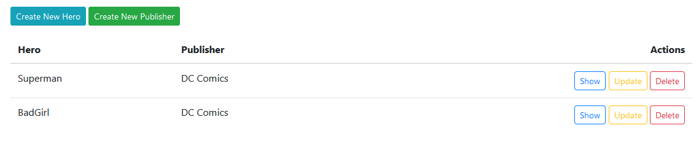

# Django Hero

Aplicación django prueba de nivel.


Se trata de una aplicación [CRUD](https://es.wikipedia.org/wiki/CRUD) sobre personajes de ficción.



**OJO** La aplicación debe ser responsive, usa [Bootstrap](https://getbootstrap.com/)

### Tareas:

1. Crear nueva aplicación *publishers* dentro de la carpeta *apps*.

    ```
    ├── apps 
    │   └── heroes
    │   └── publishers
    ...
    └── settings.py 
    └── urls.py 
    ```
    
    - Crear el modelo *Publisher* con el campo de texto *name*.
    - Funcionalidad completa *Create*, *Read*, *Update* y *Delete* de Publishers
      - Urls
      - Views  
      - Forms
      - Templates
    
    
2.  Modificar la aplicación *heroes*.
    - Modificar el modelo *Hero* agregando la clave foránea de *publishers*.
        - La relación entre *publishers* y *heroes* es 1:N (**many-to-one**)
    - Funcionalidad completa *Create*, *Read*, *Update* y *Delete* de Heroes.
        - El campo *name* debe tener una longitud minima de 3 caracteres
        - El campo *publisher* debe ser un selector.
    
    
3. Para subir nota, pon algo de tu parte (opcional).
   
    Por ejemplo:
    - Agregar un logo a la aplicación.
    - Agrega algún fichero estático (css o js).
    - Agrega paginación en los listados.  
    - Crea traducciones.
    - Feel free :)
    

------------------------------------------------
### Inicar el proyecto

```shell
$ pip install -r requirements.txt
$ python manage.py migrate
$ python manage.py loaddata data.json
$ python manage.py runserver
```
------------------------------------------------
